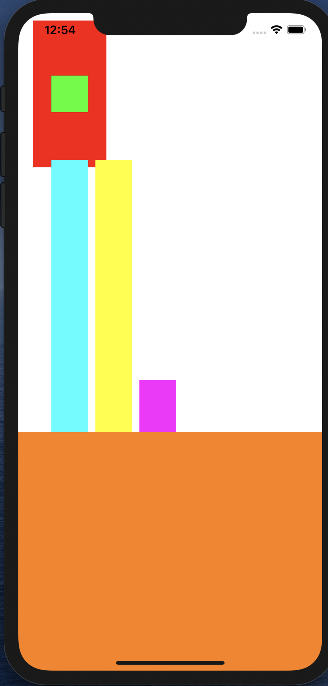

> pod "SwiftHandyFrame"

```swift
        shapeView.hf.setSize(CGSize(width: 100, height: 100))
        shapeView.hf.setLeft(20, shouldResize: false)
        shapeView.hf.setBottom(200, shouldResize: true)
        shapeView.hf.setTop(10, shouldResize: false)

        centerPositionWithOtherView.hf.setSize(CGSize(width: 50, height: 50))
        centerPositionWithOtherView.hf.setCenterEqualToView(shapeView)

        gapInOtherView.frame = centerPositionWithOtherView.frame
        gapInOtherView.hf.setInnerTopGap(200, shouldResize: false)
        gapInOtherView.hf.setInnerBottomGap(200, shouldResize: true)

        gapFromOtherView.frame = gapInOtherView.frame
        gapFromOtherView.hf.setLeftGap(10, fromView: gapInOtherView)

        positionEqualOtherView.frame = gapFromOtherView.frame
        positionEqualOtherView.hf.setInnerTopGap(500, shouldResize: true)
        positionEqualOtherView.hf.bottomEqualToView(gapFromOtherView)
        positionEqualOtherView.hf.setLeftGap(10, fromView: gapFromOtherView)

        fillView.hf.setSize(CGSize(width: 20, height: 20))
        fillView.hf.fillWidth()
        fillView.hf.setCenterYEqualToView(positionEqualOtherView)
        fillView.hf.setHeight(400)
```


